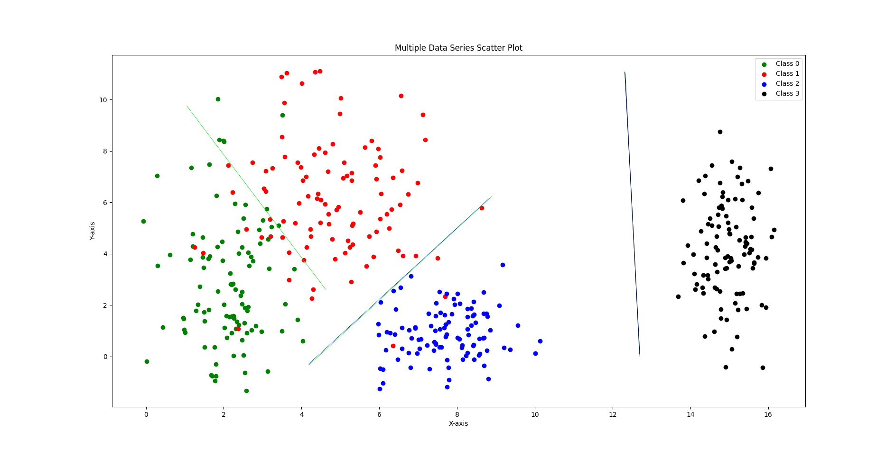
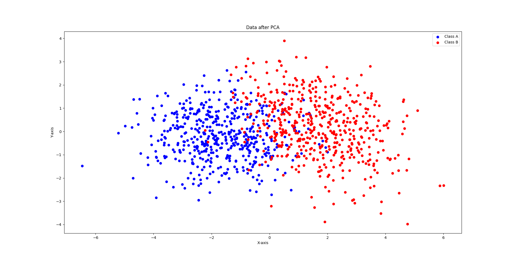
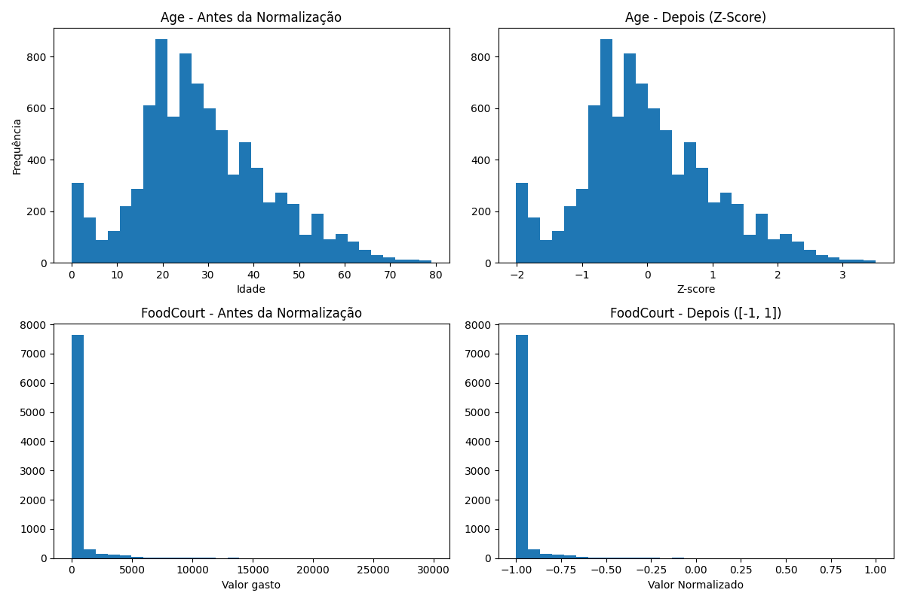

## Grupo

1. Felipe Bakowski Nantes de Souza


## Entrega

- [x] Roteiro 1 - Data 05/09/2025

## Objetivo

O objetivo desse exercício é aprender a gerar dados sintéticos e como fazer um pré-processamento adequado


### Tarefa 1


Dados sintéticos de 4 classes gerados e já separados por retas



Código

```python
import numpy as np
import matplotlib.pyplot as plt

num_samples = 100

# ---------------------------- CLASS 0 -----------------------------

mean_class_0 = [2, 3] # [mean_x, mean_y]
std_class_0 = [0.8, 2.5] # [std x, std y]

class_0_points_x = np.random.normal(loc=mean_class_0[0], scale=std_class_0[0], size=num_samples)
class_0_points_y = np.random.normal(loc=mean_class_0[1], scale=std_class_0[1], size=num_samples)

# ---------------------------- CLASS 1 -----------------------------

mean_class_1 = [5, 6] # [mean_x, mean_y]
std_class_1 = [1.2, 1.9] # [std x, std y]

class_1_points_x = np.random.normal(loc=mean_class_1[0], scale=std_class_1[0], size=num_samples)
class_1_points_y = np.random.normal(loc=mean_class_1[1], scale=std_class_1[1], size=num_samples)

# ---------------------------- CLASS 2 -----------------------------

mean_class_2 = [8, 1] # [mean_x, mean_y]
std_class_2 = [0.9, 0.9] # [std x, std y]

class_2_points_x = np.random.normal(loc=mean_class_2[0], scale=std_class_2[0], size=num_samples)
class_2_points_y = np.random.normal(loc=mean_class_2[1], scale=std_class_2[1], size=num_samples)

# ---------------------------- CLASS 3 -----------------------------

mean_class_3 = [15, 4] # [mean_x, mean_y]
std_class_3 = [0.5, 2.0] # [std x, std y]

class_3_points_x = np.random.normal(loc=mean_class_3[0], scale=std_class_3[0], size=num_samples)
class_3_points_y = np.random.normal(loc=mean_class_3[1], scale=std_class_3[1], size=num_samples)


# ---------------------------- PLOT -----------------------------
# ---------------------------- ---- -----------------------------

plt.scatter(class_0_points_x, class_0_points_y, c='green', label='Class 0')
plt.scatter(class_1_points_x, class_1_points_y, c='red', label='Class 1')
plt.scatter(class_2_points_x, class_2_points_y, c='blue', label='Class 2')
plt.scatter(class_3_points_x, class_3_points_y, c='black', label='Class 3')

plt.legend()
plt.xlabel('X-axis')
plt.ylabel('Y-axis')
plt.title('Multiple Data Series Scatter Plot')
plt.show()
```

Análise

Esse gráfico mostra 4 classes com características distintas, o fato que mais ilustra isso é a discrepância da variância entre a classe 3 e a classe 1. Enquanto esta é bem centrada e fácil de fazer uma linha que separe ela das outras, o mesmo não pode ser dito para aquela, já que ela tem grande variância e acaba por ter grande "overlap" com as outras classes também, fazendo sua separação mais difícil.

Apesar de uma separação linear funcinar até que bem para este cenário, em casos mais complexos ela não será mais suficiente. Esse fato fica evidente quando eu tentei aproximar uma separação linear que uma rede neural faria, apesar da classe 0, classe 2 e classe 3 terem espaços bem delimitados e com uma variância baixa, a classe 1 se mostrou um desafio maior para tal feito.

### Tarefa 2

Dados sintéticos de 5 features já reduzidos a 2 com PCA



Código

```python
import numpy as np
import pandas as pd
import matplotlib.pyplot as plt
from io import StringIO
from sklearn.datasets import load_iris
from sklearn.decomposition import PCA as pca
from sklearn.preprocessing import StandardScaler

# ---------------------------- CLASS A -----------------------------

# Define the mean vector
mean_a = [0, 0, 0, 0, 0]

# Define the covariance matrix
cov_a = [[1, 0.8, 0.1, 0, 0], [0.8, 1, 0.3, 0, 0], [0.1, 0.3, 1, 0.5, 0], [0, 0, 0.5, 1, 0.2], [0, 0, 0, 0.2, 1]] 

# Draw 500 samples from the multivariate normal distribution
class_a = np.random.multivariate_normal(mean_a, cov_a, size=500)

# ---------------------------- CLASS B -----------------------------

# Define the mean vector
mean_b = [1.5, 1.5, 1.5, 1.5, 1.5]

# Define the covariance matrix
cov_b = [[1.5, -0.7, 0.2, 0, 0], [-0.7, 1.5, 0.4, 0, 0], [0.2, 0.4, 1.5, 0.6, 0], [0, 0, 0.6, 1.5, 0.3], [0, 0, 0, 0.3, 1.5]] 

# Draw 500 samples from the multivariate normal distribution
class_b = np.random.multivariate_normal(mean_b, cov_b, size=500)

# ---------------------------- PCA -----------------------------

# Junta os dados
all_data = np.vstack([class_a, class_b])
sklearn_pca = pca(n_components=2)
all_pca = sklearn_pca.fit_transform(all_data)

# Separa de volta
class_a_pca = all_pca[:len(class_a)]
class_b_pca = all_pca[len(class_a):]

# ---------------------------- PLOT -----------------------------


plt.scatter(class_a_pca[:,0], class_a_pca[:,1], c='blue', label='Class A')
plt.scatter(class_b_pca[:,0], class_b_pca[:,1], c='red', label='Class B')

plt.legend()
plt.xlabel('X-axis')
plt.ylabel('Y-axis')
plt.title('Data after PCA')
plt.show()
```

Análise

A priori, pode-se observar que existe grande overlap entre as 2 classes após aplicação do método PCA e que ambas apresentam grande variância.

Sendo assim, pode-se afirmar que essas classes NÃO são linearmente separáveis, isso deve ao fato de que uma reta não é suficiente para seperar elas com precisão e precisaria de um modelo mais complexo para fazer essa classificação. Ainda, partindo da ideia de que a grosso modo "uma reta é um neurônio" fica evidente que precisamos de um modelo de rede neural de múltiplas camadas para realizar essa função


### Tarefa 3



Código

```python
import pandas as pd
from sklearn.preprocessing import LabelEncoder
import matplotlib.pyplot as plt


df = pd.read_csv("train.csv")

# print(df.columns[df.isnull().any()]) #encontra colunas com valores faltando
# print(df)

#Configuração para arrumar fillna deprecated
pd.set_option('future.no_silent_downcasting', True)

#Data cleaning
#Categorial
df.dropna(subset=['Name'], inplace=True)  
df['HomePlanet'] = df['HomePlanet'].fillna(df['HomePlanet'].mode()[0])
df['CryoSleep'] = df['CryoSleep'].fillna(df['CryoSleep'].mode()[0])
df['Cabin'] = df['Cabin'].fillna(df['Cabin'].mode()[0])
df['Destination'] = df['Destination'].fillna(df['Destination'].mode()[0])
df['VIP'] = df['VIP'].fillna(df['VIP'].mode()[0])

# Numéricas
df['Age'] = df['Age'].fillna(df['Age'].median())
df['RoomService'] = df['RoomService'].fillna(df['RoomService'].median())
df['FoodCourt'] = df['FoodCourt'].fillna(df['FoodCourt'].median())
df['ShoppingMall'] = df['ShoppingMall'].fillna(df['ShoppingMall'].median())
df['Spa'] = df['Spa'].fillna(df['Spa'].median())
df['VRDeck'] = df['VRDeck'].fillna(df['VRDeck'].median())

age_prev = df['Age']
food_prev = df['FoodCourt']

# Convert categorical variables
label_encoder = LabelEncoder()
df['HomePlanet'] = label_encoder.fit_transform(df['HomePlanet'])
df['CryoSleep'] = label_encoder.fit_transform(df['CryoSleep'])
df['Cabin'] = label_encoder.fit_transform(df['Cabin'])
df['Destination'] = label_encoder.fit_transform(df['Destination'])
df['Name'] = label_encoder.fit_transform(df['Name'])
#True or false
df['VIP'] = label_encoder.fit_transform(df['VIP'])
df['Transported'] = label_encoder.fit_transform(df['Transported'])

# print(df.columns[df.isnull().any()]) #roda mais uma vez para verificar se tem null ainda

# print(30*'-')
# print(df)

#Normalizing Data
df['Age'] = df['Age'].apply(lambda x: (x-df['Age'].mean())/df['Age'].std())
df['RoomService'] = df['RoomService'].apply(
    lambda x: 2 * (x - df['RoomService'].min()) / (df['RoomService'].max() - df['RoomService'].min()) - 1
)
df['FoodCourt'] = df['FoodCourt'].apply(
    lambda x: 2 * (x - df['FoodCourt'].min()) / (df['FoodCourt'].max() - df['FoodCourt'].min()) - 1
)
df['ShoppingMall'] = df['ShoppingMall'].apply(
    lambda x: 2 * (x - df['ShoppingMall'].min()) / (df['ShoppingMall'].max() - df['ShoppingMall'].min()) - 1
)
df['Spa'] = df['Spa'].apply(
    lambda x: 2 * (x - df['Spa'].min()) / (df['Spa'].max() - df['Spa'].min()) - 1
)
df['VRDeck'] = df['VRDeck'].apply(
    lambda x: 2 * (x - df['VRDeck'].min()) / (df['VRDeck'].max() - df['VRDeck'].min()) - 1
)

# print(30*'-')
print(df)

#Histogramas
fig, axes = plt.subplots(2, 2, figsize=(12, 8))

axes[0, 0].hist(age_prev, bins=30)
axes[0, 0].set_title("Age - Antes da Normalização")
axes[0, 0].set_xlabel("Idade")
axes[0, 0].set_ylabel("Frequência")

axes[0, 1].hist(df['Age'], bins=30)
axes[0, 1].set_title("Age - Depois (Z-Score)")
axes[0, 1].set_xlabel("Z-score")

axes[1, 0].hist(food_prev, bins=30)
axes[1, 0].set_title("FoodCourt - Antes da Normalização")
axes[1, 0].set_xlabel("Valor gasto")

axes[1, 1].hist(df['FoodCourt'], bins=30)
axes[1, 1].set_title("FoodCourt - Depois ([-1, 1])")
axes[1, 1].set_xlabel("Valor Normalizado")

plt.tight_layout()
plt.show()
```

Análise

De início, podemos analisar quais features são categoricas e quais são numéricas, as categoricas são: "HomePlanet", "CryoSleep", "Cabin", "Destination", "Name", "VIP", "Transported". Enquanto as numéricas são: "Age", "RoomService", "FoodCourt", "ShoppingMall", "ShoppingMall", "Spa", "VRDeck".


Algumas dessas variáveis são bem auto explicativas, como idade, mas agora irei explicar algumas das menos intuitivas: A variável CryoSleep mostra se o passageiro optou por permanecer em animação suspensa (sono criogênico) durante a viagem, o que significa que ele ficava confinado em sua cabine, a variável Transported informa se o passageiro foi transportado para outra dimensão durante o incidente da nave, sendo esta a variável-alvo que deve ser prevista nos modelos. As variáveis RoomService, FoodCourt, ShoppingMall, Spa e VRDeck registram, respectivamente, os valores gastos em diferentes serviços do navio: serviço de quarto, praça de alimentação, lojas, spa e experiências de realidade virtual no deck de VR. Essas variáveis numéricas permitem avaliar tanto o perfil de consumo dos passageiros quanto possíveis padrões de comportamento.

Mas, nem todos esses dados estão perfeitos, a verdade é que quase todas as colunas tem valores faltando (print(df.columns[df.isnull().any()]) mostra quais). Agora, como podemos lidar com isso ? o mais fácil foi eliminar todas as linhas em que o nome do passageira estava faltando, pois não há nenhum método que justifique inventar um nome para a pessoa de modo que faça sentido. Em relação a todas as outras variáveis categóricas podemos preenchê-las com a moda dessa coluna, isso minimiza os danos a distorção dos dados e nos permite reaproveitar o resto dessa linha. Nesse passo, com as variáveis quantitivas preenchemos os valores faltando com a mediana (preferimos em relação a média pois causa uma distorção menor nesse cenário em que há muitos valores extremos, veremos isso depois), com a mesma justificativa da anterior.

Para encoding das variáveis categorias foi usado o método de one-hot encoding pela sua facilidade e então aplicamos a Standardization na variável age, pois ela geralmente já segue uma distribuição normal e uma Normalização em todas as outras numéricas, pois elas não seguem esse distribuição, são constrituidas de muitos valores extremos.

Assim, pode-se ver a diferença entras os dados sem esse tratamento e depois desse tratamento na figura acima para 2 features

