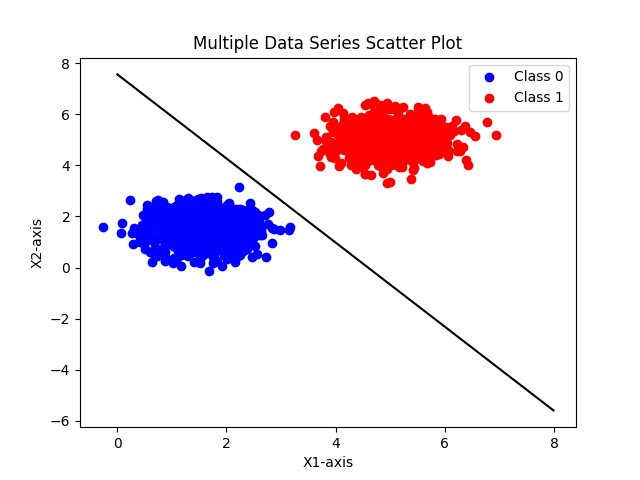
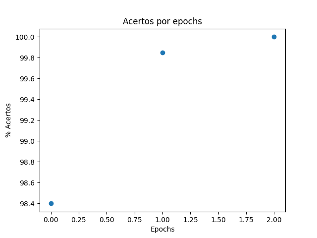
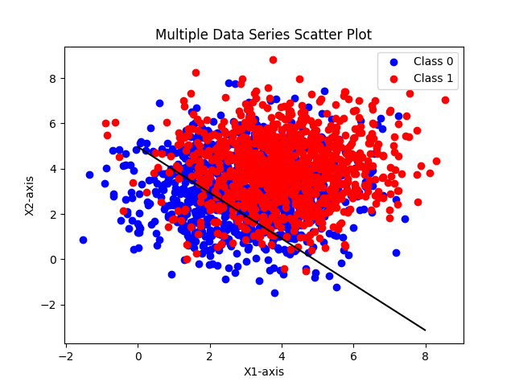
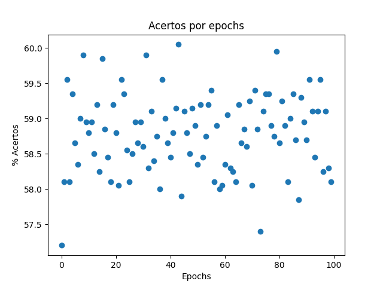

## Grupo

1. Felipe Bakowski Nantes de Souza


## Entrega

- [x] Roteiro 2 - Data 14/09/2025

## Objetivo

Aprender a implementar um perceptron e entender suas limitações para separação de classes

### Tarefa 1

Gere 2 classes, com 1000 pontos cada, em um espaço 2D e utilize suas implentanção de perceptron para separá-las

## Especificações: 
    Class 0:
        - Média [1.5, 1.5]
        - Cov matrix: [[0.5,0], [0,0.5]]
    Class 1:
        - Média [5,5]
        - Cov matrix: [[0.5,0], [0,0.5]]


### Pontos do primeiro caso com reta definida pelo perceptron


### Convergência por epochs


### Parâmetros escolhidos pelo perceptron:
    Novos weights: [0.03266194 0.01985417] e novo bias: -0.15

Código

```python
import numpy as np
import matplotlib.pyplot as plt
import pandas as pd
import perceptron as pt

num_samples = 1000

mean_class_0 = [1.5, 1.5]
std_class_0 = [0.5, 0.5] 

class_0_points_x1 = np.random.normal(loc=mean_class_0[0], scale=std_class_0[0], size=num_samples)
class_0_points_x2 = np.random.normal(loc=mean_class_0[1], scale=std_class_0[1], size=num_samples)
class_0_points_y = pd.Series([0]*num_samples)

mean_class_1 = [5, 5] 
std_class_1 = [0.5, 0.5] 

class_1_points_x1 = np.random.normal(loc=mean_class_1[0], scale=std_class_1[0], size=num_samples)
class_1_points_x2 = np.random.normal(loc=mean_class_1[1], scale=std_class_1[1], size=num_samples)
class_1_points_y = pd.Series([1]*num_samples)

c0_x1 = pd.Series(class_0_points_x1)
c1_x1 = pd.Series(class_1_points_x1)

c0_x2 = pd.Series(class_0_points_x2)
c1_x2 = pd.Series(class_1_points_x2)

x1 = pd.concat([c0_x1, c1_x1], ignore_index=True)
x2 = pd.concat([c0_x2, c1_x2], ignore_index=True)
y = pd.concat([class_0_points_y, class_1_points_y], ignore_index=True)

df = pd.DataFrame({
    'x1':x1,
    'x2':x2,
    'y':y
})

df = df.sample(frac=1, random_state=42).reset_index(drop=True)

w = [0,0]
b = 0
eta = 0.01
epochs = 100
acertos = []

w,b,acertos = pt.train(df, w=w, b=b, eta=eta, epochs=epochs)

print(f"Novos wights: {w} e novo bias: {b}")

epochs_list = np.arange(0,len(acertos),1)

x_reta, y_reta = pt.create_line(w,b)
acertos = pt.calculate_accuracy(acertos, len(df)) 

plt.scatter(epochs_list, acertos)
plt.xlabel('Epochs')
plt.ylabel('% Acertos')
plt.title('Acertos por epochs')
plt.show()

plt.scatter(class_0_points_x1, class_0_points_x2, c='blue', label='Class 0')
plt.scatter(class_1_points_x1, class_1_points_x2, c='red', label='Class 1')
plt.plot(x_reta, y_reta, color='black')

plt.legend()
plt.xlabel('X1-axis')
plt.ylabel('X2-axis')
plt.title('Multiple Data Series Scatter Plot')
plt.show()
```

Análise

Pode-se observar que nessa caso é possível realizar uma separação dessas 2 classes com apenas 1 perceptron, isso se deve ao fato de ambas tem médias
muito distantes uma da outra e um desvio padrão muito baixo nos 2 casos. Assim, esse é um caso bem factível com um perceptron.

### Tarefa 2

Gere 2 classes, com 1000 pontos cada, em um espaço 2D e utilize suas implentanção de perceptron para separá-las

## Especificações: 
    Class 0:
        - Média [3, 3]
        - Cov matrix: [[1.5,0], [0,1.5]]
    Class 1:
        - Média [4,4]
        - Cov matrix: [[1.5,0], [0,1.5]]


### Pontos do segundo caso com reta definida pelo perceptron


### Convergência por epochs


### Parâmetros escolhidos pelo perceptron:
    Novos weights: [0.05104332 0.0504264 ] e novo bias: -0.25000000000000006

Código

```python
import numpy as np
import matplotlib.pyplot as plt
import pandas as pd
import perceptron as pt

num_samples = 1000

mean_class_0 = [3, 3]
std_class_0 = [1.5, 1.5] 

class_0_points_x1 = np.random.normal(loc=mean_class_0[0], scale=std_class_0[0], size=num_samples)
class_0_points_x2 = np.random.normal(loc=mean_class_0[1], scale=std_class_0[1], size=num_samples)
class_0_points_y = pd.Series([0]*num_samples)

mean_class_1 = [4, 4] 
std_class_1 = [1.5, 1.5] 

class_1_points_x1 = np.random.normal(loc=mean_class_1[0], scale=std_class_1[0], size=num_samples)
class_1_points_x2 = np.random.normal(loc=mean_class_1[1], scale=std_class_1[1], size=num_samples)
class_1_points_y = pd.Series([1]*num_samples)

c0_x1 = pd.Series(class_0_points_x1)
c1_x1 = pd.Series(class_1_points_x1)

c0_x2 = pd.Series(class_0_points_x2)
c1_x2 = pd.Series(class_1_points_x2)

x1 = pd.concat([c0_x1, c1_x1], ignore_index=True)
x2 = pd.concat([c0_x2, c1_x2], ignore_index=True)
y = pd.concat([class_0_points_y, class_1_points_y], ignore_index=True)

df = pd.DataFrame({
    'x1':x1,
    'x2':x2,
    'y':y
})

df = df.sample(frac=1, random_state=42).reset_index(drop=True)

w = [0,0]
b = 0
eta = 0.01
epochs = 100
acertos = []

w,b,acertos = pt.train(df, w=w, b=b, eta=eta, epochs=epochs)

print(f"Novos wights: {w} e novo bias: {b}")

epochs_list = np.arange(0,len(acertos),1)

x_reta, y_reta = pt.create_line(w,b)
acertos = pt.calculate_accuracy(acertos, len(df)) 

plt.scatter(epochs_list, acertos)
plt.xlabel('Epochs')
plt.ylabel('% Acertos')
plt.title('Acertos por epochs')
plt.show()

plt.scatter(class_0_points_x1, class_0_points_x2, c='blue', label='Class 0')
plt.scatter(class_1_points_x1, class_1_points_x2, c='red', label='Class 1')
plt.plot(x_reta, y_reta, color='black')

plt.legend()
plt.xlabel('X1-axis')
plt.ylabel('X2-axis')
plt.title('Multiple Data Series Scatter Plot')
plt.show()
```

Análise

Nesse cenário, observa-se que é impossível 1 perceptron dar conta de separar essas 2 classes, a primeira evidência disso é a ausência de convergência do modelo, ele fica alteranando entre 50% e 60% de precisão (classificações corretas / Total samples). Depois, podemos observar que existe grande overlap entre as classes, devido as médias parecidas e grande desvio padrão delas. Desse modo, fica nítido que a reta não consegue separá-las propriamente.

# Implementação perceptron

```python
import pandas as pd
import numpy as np

def calculate_z(w,x,b):
    return np.dot(w,x) + b

def activation(z):
    if z >= 0:
        return 1
    else:
        return 0
    
def update(erro, w, b, eta, x):
    return w + eta*erro*x , b + eta*erro

def train(df, w, b, eta, epochs):
    x1 = df['x1']
    x2 = df['x2']
    y = df['y']
    features = [x1,x2]
    x = []
    w_train = w
    b_train = b
    epoch = 0
    acertos = 0
    acertos_por_epoch = []

    while epoch < epochs: #um epoch eh um pass completo sobre os dados

        for i in range(len(y)):
            for feature in features:
                x.append(float(feature[i]))

            z = calculate_z(w_train,x,b_train)
            y_calculated = activation(z)
            erro = y[i] - y_calculated

            if erro != 0:
                w_train, b_train = update(erro, w_train, b_train, eta, np.array(x))
            else:
                acertos += 1

            if acertos == len(y):
                acertos_por_epoch.append(acertos)
                return w_train, b_train, acertos_por_epoch

            x = []

        acertos_por_epoch.append(acertos)
        acertos = 0
        epoch += 1

    return w_train, b_train, acertos_por_epoch

def calculate_accuracy(acertos, len_dataset):
    acertos = pd.Series(acertos)
    acertos = (acertos/len_dataset)*100
    return acertos

def create_line(w,b):
    x_reta = np.arange(0,8,0.01)
    y = []
    for x in x_reta:
        r = -x*(w[0]/w[1]) - (b/w[1])
        y.append(r)
    return x_reta, y
```


