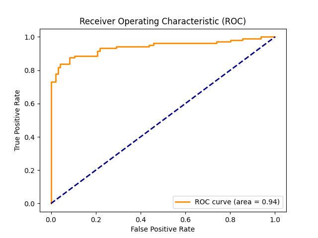
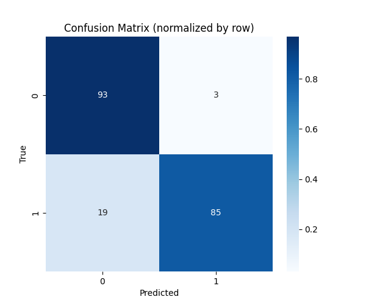
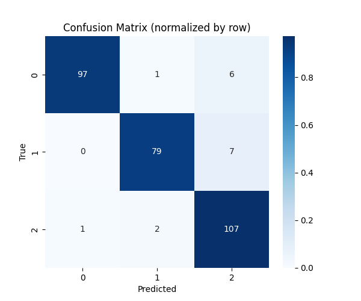
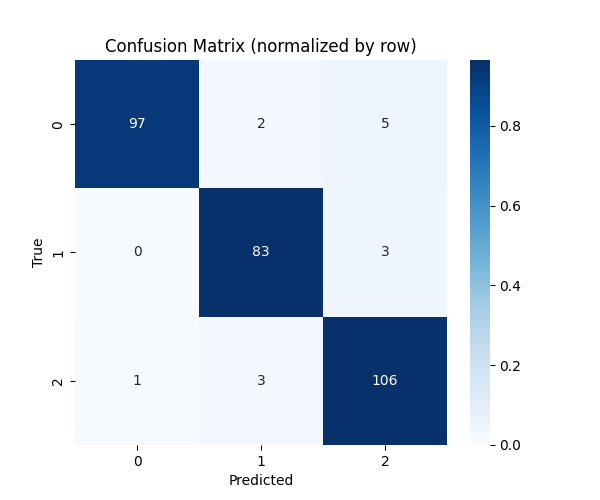

## Grupo

1. Felipe Bakowski Nantes de Souza


## Entrega

- [x] Roteiro 3 - Data 21/09/2025

## Objetivo

Implementar um MLP e testá-lo em casos distintos. Ainda, validar o conhecimento em calcular forward propagation, back, loss, etc, manualmente

### Tarefa 1

Para os seguintes parâmetros:

    x = [0.5, -0.2]
    y = 1

    w1 = [[0.3, -0.1],
        [0.2,  0.4]]

    b1 = [0.1, -0.2]

    w2 = [0.5, -0.3]

    b2 = 0.2

    eta = 0.3

    act func = tanh

Calcule o forward pass, loss, backward pass e parameter update.

Para tal utilizamos o seguinte código:

```python
import pandas as pd
import numpy as np
from sklearn.datasets import make_classification

# Manual calculation of MLP

# Preparation
x = np.array([0.5, -0.2])
y = 1
w_hidden = np.array([[0.3, -0.1],
                     [0.2, 0.4]])
b_hidden = np.array([0.1, -0.2])
w_out = np.array([0.5, -0.3])
b_out = 0.2
eta = 0.1

# === Forward pass ===
z_hidden = np.dot(w_hidden, x) + b_hidden
a_hidden = np.tanh(z_hidden)
z_out = np.dot(w_out, a_hidden) + b_out
y_out = np.tanh(z_out)

loss = (y - y_out)**2

print("\n=== FORWARD PASS ===")
print(f"Input x: {x}")
print(f"Hidden pre-activation z_hidden: {z_hidden}")
print(f"Hidden activation a_hidden (tanh): {a_hidden}")
print(f"Output pre-activation z_out: {z_out:.4f}")
print(f"Output y_out (tanh): {y_out:.4f}")
print(f"Loss: {loss:.6f}")

# === Backward Pass ===
dloss_dy_out = -2*(y - y_out)
dloss_dz_out = dloss_dy_out*(1 - y_out**2)

dloss_dw_out1 = dloss_dz_out*a_hidden[0]
dloss_dw_out2 = dloss_dz_out*a_hidden[1]
dloss_db_out = dloss_dz_out

dloss_da_hidden1 = dloss_dz_out*w_out[0]
dloss_da_hidden2 = dloss_dz_out*w_out[1]
dloss_dz_hidden1 = dloss_da_hidden1 * (1 - a_hidden[0]**2)
dloss_dz_hidden2 = dloss_da_hidden2 * (1 - a_hidden[1]**2)

dloss_dw_hidden11 = dloss_dz_hidden1*x[0]
dloss_dw_hidden21 = dloss_dz_hidden1*x[1]
dloss_dw_hidden12 = dloss_dz_hidden2*x[0]
dloss_dw_hidden22 = dloss_dz_hidden2*x[1]
dloss_db_hidden1 = dloss_dz_hidden1
dloss_db_hidden2 = dloss_dz_hidden2

# === PRINT BACKPROP RESULTS ===
print("\n=== BACKWARD PASS ===")
print(f"dL/dy_out: {dloss_dy_out:.6f}")
print(f"dL/dz_out: {dloss_dz_out:.6f}")

print("\n-- Gradientes saída --")
print(f"dL/dw_out: [{dloss_dw_out1:.6f}, {dloss_dw_out2:.6f}]")
print(f"dL/db_out: {dloss_db_out:.6f}")

print("\n-- Propagação para hidden --")
print(f"dL/da_hidden: [{dloss_da_hidden1:.6f}, {dloss_da_hidden2:.6f}]")
print(f"dL/dz_hidden: [{dloss_dz_hidden1:.6f}, {dloss_dz_hidden2:.6f}]")

print("\n-- Gradientes hidden weights --")
grad_hidden = pd.DataFrame(
    [[dloss_dw_hidden11, dloss_dw_hidden21],
     [dloss_dw_hidden12, dloss_dw_hidden22]],
    columns=["x1", "x2"],
    index=["h1", "h2"]
)
print(grad_hidden)

print("\n-- Gradientes hidden biases --")
print(f"dL/db_hidden: [{dloss_db_hidden1:.6f}, {dloss_db_hidden2:.6f}]")

# ==== PARAMETER UPDATES =====
print("\n=== UPDATE PARAMETERS ===")
print("Antes da atualização:")
print("w_hidden:\n", w_hidden)
print("b_hidden:", b_hidden)
print("w_out:", w_out)
print("b_out:", b_out)

# Atualização da camada escondida
w_hidden[0][0] -= eta * dloss_dw_hidden11
w_hidden[0][1] -= eta * dloss_dw_hidden21
w_hidden[1][0] -= eta * dloss_dw_hidden12
w_hidden[1][1] -= eta * dloss_dw_hidden22

b_hidden[0] -= eta * dloss_db_hidden1
b_hidden[1] -= eta * dloss_db_hidden2

# Atualização da camada de saída
w_out[0] -= eta * dloss_dw_out1
w_out[1] -= eta * dloss_dw_out2
b_out    -= eta * dloss_db_out

print("\nDepois da atualização:")
print("w_hidden:\n", w_hidden)
print("b_hidden:", b_hidden)
print("w_out:", w_out)
print("b_out:", b_out)
```

que gerou o seguinte output:

```
=== FORWARD PASS ===
Input x: [ 0.5 -0.2]
Hidden pre-activation z_hidden: [ 0.27 -0.18]
Hidden activation a_hidden (tanh): [ 0.26362484 -0.17808087]
Output pre-activation z_out: 0.3852
Output y_out (tanh): 0.3672
Loss: 0.400377

=== BACKWARD PASS ===
dL/dy_out: -1.265507
dL/dz_out: -1.094828

-- Gradientes saída --
dL/dw_out: [-0.288624, 0.194968]
dL/db_out: -1.094828

-- Propagação para hidden --
dL/da_hidden: [-0.547414, 0.328448]
dL/dz_hidden: [-0.509370, 0.318032]

-- Gradientes hidden weights --
          x1        x2
h1 -0.254685  0.101874
h2  0.159016 -0.063606

-- Gradientes hidden biases --
dL/db_hidden: [-0.509370, 0.318032]

=== UPDATE PARAMETERS ===
Antes da atualização:
w_hidden:
 [[ 0.3 -0.1]
 [ 0.2  0.4]]
b_hidden: [ 0.1 -0.2]
w_out: [ 0.5 -0.3]
b_out: 0.2

Depois da atualização:
w_hidden:
 [[ 0.32546849 -0.1101874 ]
 [ 0.18409838  0.40636065]]
b_hidden: [ 0.15093698 -0.23180324]
w_out: [ 0.52886238 -0.31949679]
b_out: 0.30948279147136
```
### Tarefa 2

## Nota: para as seguintes tarefas foi utilizada uma mesma MLP que da conta de suprir todas as necessidades, código dela no final da página

Utilizando as seguintes especificações: 

N amostras: 1000

N classes: 2

N de clusters por classe: 
classe 0 -> 1 cluster
classe 1 -> 2 clusters

crie dados que seguem essas características e mande os resultado.

Assim, o código para criar esses dados é o seguinte:

```python
import numpy as np
from sklearn.datasets import make_classification
from sklearn.model_selection import train_test_split
from mlp import mlp

# ===== BINARY CLASSIFICATION (Exercise 2) =====
# Classe 0: 1 cluster
X0, y0 = make_classification(
    n_samples=500, n_classes=1, n_clusters_per_class=1,
    n_features=2, n_informative=2, n_redundant=0,
    class_sep=2.0, random_state=42
)
y0[:] = 0  # força classe 0

# Classe 1: 2 clusters
X1, y1 = make_classification(
    n_samples=500, n_classes=1, n_clusters_per_class=2,
    n_features=2, n_informative=2, n_redundant=0,
    class_sep=2.0, random_state=24
)
y1[:] = 1  # força classe 1

# Combina
X = np.vstack([X0, X1])
y = np.hstack([y0, y1])

# Split train/test (80/20)
X_train, X_test, y_train, y_test = train_test_split(X, y, test_size=0.2, random_state=42)

# Cria MLP para classificação binária
mlp = mlp(
    n_features=2,
    n_hidden_layers=1,
    n_neurons_per_layer=[4, 1],  # hidden=4, output=1
    activation='tanh',
    loss='mse', #saida é binária, utilizamos mse
    optimizer='gd',
    epochs=200,
    eta=0.1
)

# Treina
mlp.train(X_train, y_train)

# Testa e avalia
y_pred = mlp.test(X_test)
mlp.evaluate(X_test, y_test, plot_confusion=True, plot_roc=True, preds=y_pred)
```

e o modelo resultante é o seguinte:

```text
=== Inicialização de Pesos e Biases ===
Camada 1:
W1 shape (4, 2):
[[ 0.06282189 -0.01995681]
 [-0.09948727 -0.08671114]
 [ 0.08370109 -0.10908174]
 [-0.01757068  0.09519239]]
b1 shape (4,):
[0. 0. 0. 0.]

Camada 2:
W2 shape (1, 4):
[[ 0.0665476  -0.14808445  0.11787561 -0.08045228]]
b2 shape (1,):
[0.]

Epoch 0, Loss: 0.200536
Epoch 10, Loss: 0.137519
Epoch 20, Loss: 0.135654
Epoch 30, Loss: 0.135681
Treinamento encerrado no epoch 35 (convergência detectada).
Accuracy: 89.00%

=== Pesos e Biases do Modelo ===

Camada 1:
  Pesos W1 (shape (4, 2)):
[[ 0.01028162 -0.00596175]
 [-2.2332656  -2.97995227]
 [-1.69882465 -3.34039644]
 [-0.02222276  0.02191908]]
  Biases b1 (shape (4,)):
[ 0.03770969  5.99630873 -1.43428069 -0.1020545 ]

Camada 2:
  Pesos W2 (shape (1, 4)):
[[-0.00147906 -0.91664343  0.8594697   0.00384365]]
  Biases b2 (shape (1,)):
[1.97320113]
```

Ainda, observa-se as imagens do roc curve e da matriz de confusão que deixam em evidência outras características do modelos






### Tarefa 3

Muito parecido com a tarefa 2, utilizando as seguintes especificações: 

N amostras: 1500

N classes: 3

N features: 4

N de clusters por classe: 
classe 0 -> 2 cluster
classe 1 -> 3 clusters
classe 2 -> 4 clusters

crie dados que seguem essas características e mande os resultado.

Assim, o código para criar esses dados é o seguinte:

```python
import numpy as np
from sklearn.datasets import make_classification
from sklearn.model_selection import train_test_split
from mlp import mlp

# ===== MULTI-CLASS CLASSIFICATION (Exercise 3) =====
# Classe 0: 2 clusters
X0, y0 = make_classification(
    n_samples=500, n_classes=1, n_clusters_per_class=2,
    n_features=4, n_informative=4, n_redundant=0,
    class_sep=2.0, random_state=42
)
y0[:] = 0

# Classe 1: 3 clusters
X1, y1 = make_classification(
    n_samples=500, n_classes=1, n_clusters_per_class=3,
    n_features=4, n_informative=4, n_redundant=0,
    class_sep=2.0, random_state=24
)
y1[:] = 1

# Classe 2: 4 clusters
X2, y2 = make_classification(
    n_samples=500, n_classes=1, n_clusters_per_class=4,
    n_features=4, n_informative=4, n_redundant=0,
    class_sep=2.0, random_state=100
)
y2[:] = 2

# Combina
X = np.vstack([X0, X1, X2])
y = np.hstack([y0, y1, y2])

# Split train/test
X_train, X_test, y_train, y_test = train_test_split(X, y, test_size=0.2, random_state=42)

# Cria MLP para multi-class
mlp = mlp(
    n_features=4,
    n_hidden_layers=1,
    n_neurons_per_layer=[8, 3],  # hidden=8, output=3 classes
    activation='tanh',
    loss='cross_entropy',
    optimizer='gd',
    epochs=300,
    eta=0.05
)

# Treina
mlp.train(X_train, y_train)

# Testa e avalia
y_pred = mlp.test(X_test)
mlp.evaluate(X_test, y_test, plot_confusion=True, plot_roc=False, preds=y_pred)
```

e o resultado foi o segiunte:

```text
=== Inicialização de Pesos e Biases ===
Camada 1:
W1 shape (8, 4):
[[-0.15012286  0.03636618  0.00755215  0.11669222]
 [-0.08320915  0.06254752 -0.06307116 -0.14782926]
 [ 0.0022151  -0.14332554 -0.05004609 -0.0201836 ]
 [-0.00959626 -0.08452745  0.06800672  0.04447651]
 [-0.06675591  0.02716564 -0.0402755   0.04110338]
 [ 0.01647392  0.23689506  0.13759678 -0.17216953]
 [ 0.13695956 -0.01969437 -0.02480733  0.06700953]
 [-0.1538137  -0.07199269 -0.23851082  0.08865847]]
b1 shape (8,):
[0. 0. 0. 0. 0. 0. 0. 0.]

Camada 2:
W2 shape (3, 8):
[[-0.03102423  0.14114412  0.12651862  0.0525337   0.00188353  0.0778287
   0.21716552 -0.10621928]
 [ 0.10797846 -0.00570225 -0.10403077  0.11305206 -0.0683529  -0.01938096
  -0.03513866  0.06930014]
 [ 0.07062139  0.14148664 -0.03282687 -0.04611272 -0.2125965   0.14508146
  -0.13255499 -0.07127306]]
b2 shape (3,):
[0. 0. 0.]

Epoch 0, Loss: 0.426007
Epoch 10, Loss: 0.199110
Epoch 20, Loss: 0.153921
Epoch 30, Loss: 0.160203
Epoch 40, Loss: 0.164695
Epoch 50, Loss: 0.169913
Epoch 60, Loss: 0.173882
Epoch 70, Loss: 0.171059
Epoch 80, Loss: 0.146784
Epoch 90, Loss: 0.157961
Epoch 100, Loss: 0.136661
Epoch 110, Loss: 0.140420
Epoch 120, Loss: 0.142970
Epoch 130, Loss: 0.161925
Epoch 140, Loss: 0.174006
Epoch 150, Loss: 0.124596
Epoch 160, Loss: 0.127589
Epoch 170, Loss: 0.133139
Epoch 180, Loss: 0.136089
Epoch 190, Loss: 0.127153
Epoch 200, Loss: 0.152746
Epoch 210, Loss: 0.140961
Epoch 220, Loss: 0.146886
Epoch 230, Loss: 0.117297
Epoch 240, Loss: 0.125047
Epoch 250, Loss: 0.118332
Epoch 260, Loss: 0.133416
Epoch 270, Loss: 0.157566
Epoch 280, Loss: 0.115870
Epoch 290, Loss: 0.141657
Accuracy: 94.33%

=== Pesos e Biases do Modelo ===

Camada 1:
  Pesos W1 (shape (8, 4)):
[[ -0.08576299  -0.95087168   2.55816272  13.44105675]
 [ -6.19685875  -1.0703442    0.06318581  -4.74594758]
 [ -0.30086178  -5.80590108  -3.15007815  -3.05409815]
 [ 10.22280012  -1.71382584   1.54665281   3.83600643]
 [ -0.67082362   1.81448785  -7.83430673  -2.71605366]
 [  3.42071321   9.41193187  -5.31067459   8.37335265]
 [ -5.95157244   0.94694413   0.79513151 -10.44803795]
 [ -3.83236454   1.58829969  -6.61690407   4.25813743]]
  Biases b1 (shape (8,)):
[  2.98018584  -8.2687564  -17.15145087   3.00833864  -2.61779085
 -18.47840645   4.66698319  -1.45933255]

Camada 2:
  Pesos W2 (shape (3, 8)):
[[-3.08806844 -0.40361496  2.68544436 -1.59783599  1.93742736  0.79406231
   1.26835691  1.03757026]
 [ 1.12279544 -0.83468701 -0.32344479  1.70018782 -1.86252433  3.18272202
   1.1324417   0.35434438]
 [ 2.11284863  1.51523047 -2.37233858  0.01712121 -0.35396892 -3.77325513
  -2.35132674 -1.50010685]]
  Biases b2 (shape (3,)):
[-1.54010396  2.56898611 -1.02888214]
```

Ainda, observa-se a imagen da matriz de confusão que deixa em evidência outras características do modelos




### Tarefa 4

Por fim, repetiremos a mesma coisa do exercício 3, mas com 2 camadas ocultas.

O código para tal foi: 

```python
import numpy as np
from sklearn.datasets import make_classification
from sklearn.model_selection import train_test_split
from mlp import mlp
# ===== MULTI-CLASS CLASSIFICATION (Exercise 4) =====
# Classe 0: 2 clusters
X0, y0 = make_classification(
    n_samples=500, n_classes=1, n_clusters_per_class=2,
    n_features=4, n_informative=4, n_redundant=0,
    class_sep=2.0, random_state=42
)
y0[:] = 0

# Classe 1: 3 clusters
X1, y1 = make_classification(
    n_samples=500, n_classes=1, n_clusters_per_class=3,
    n_features=4, n_informative=4, n_redundant=0,
    class_sep=2.0, random_state=24
)
y1[:] = 1

# Classe 2: 4 clusters
X2, y2 = make_classification(
    n_samples=500, n_classes=1, n_clusters_per_class=4,
    n_features=4, n_informative=4, n_redundant=0,
    class_sep=2.0, random_state=100
)
y2[:] = 2

# Combina
X = np.vstack([X0, X1, X2])
y = np.hstack([y0, y1, y2])

# Split train/test
X_train, X_test, y_train, y_test = train_test_split(X, y, test_size=0.2, random_state=42)

# Cria MLP para multi-class
# ===== MULTI-CLASS WITH DEEPER MLP (Exercise 4) =====
mlp_deep = mlp(
    n_features=4,
    n_hidden_layers=2,
    n_neurons_per_layer=[16, 8, 3],  # duas hidden layers
    activation='relu', #relu melhora performance
    loss='cross_entropy',
    optimizer='gd',
    epochs=400, #mais epochs por ser maior
    eta=0.01
)

mlp_deep.train(X_train, y_train)

y_pred = mlp_deep.test(X_test)
mlp_deep.evaluate(X_test, y_test, plot_confusion=True, plot_roc=False, preds=y_pred)
```

e o resultado foi o seguinte:

```text
=== Inicialização de Pesos e Biases ===
Camada 1:
W1 shape (16, 4):
[[ 0.00555123  0.02945733  0.00320483  0.14107248]
 [ 0.01309987 -0.14536763 -0.24914801 -0.1097325 ]
 [ 0.13263989 -0.00845282  0.04363311 -0.20942593]
 [ 0.06151256  0.17526377  0.06525152 -0.143594  ]
 [ 0.19053969  0.05164986 -0.06384301 -0.13528166]
 [-0.01802708 -0.06539238 -0.23653229 -0.06647837]
 [-0.1773437   0.18719514 -0.2432306  -0.13664237]
 [-0.03559021  0.09356135  0.00909633 -0.02496799]
 [-0.010703   -0.05643333  0.14452321 -0.12340063]
 [-0.11520311  0.12193497 -0.01601216 -0.04162409]
 [ 0.10112067 -0.06794277 -0.09689412 -0.07876592]
 [ 0.10129985  0.13837398 -0.0192343   0.28110855]
 [ 0.06734521  0.04200509  0.06857739 -0.0089593 ]
 [ 0.03230203 -0.086233    0.05157866 -0.08939185]
 [-0.05631417  0.09558788  0.03310292 -0.03783207]
 [ 0.26892547 -0.0355394  -0.23973207  0.12095571]]
b1 shape (16,):
[0. 0. 0. 0. 0. 0. 0. 0. 0. 0. 0. 0. 0. 0. 0. 0.]

Camada 2:
W2 shape (8, 16):
[[ 0.02722147  0.07925187 -0.08892502  0.07395878 -0.03866726  0.04836275
   0.03062031 -0.01350536  0.00136201  0.0866263  -0.11018394 -0.00879913
   0.04369193  0.08227613  0.0774328   0.06628226]
 [-0.00382254 -0.04122877 -0.12089201 -0.09174723  0.28529764  0.04758449
  -0.12776212  0.00118261 -0.22349046  0.18041981 -0.01872715 -0.05201189
   0.00592675  0.01669519  0.11267001  0.06858279]
 [ 0.0127937  -0.03001005  0.01187981 -0.0564881   0.07511489 -0.34500628
  -0.07107095  0.11538678 -0.01051689  0.0867737   0.15186372  0.04087284
   0.06905849  0.14079224 -0.18074581  0.06372337]
 [-0.04562775  0.01619738 -0.0616143   0.00100512  0.13642802 -0.06340487
   0.13042471 -0.02625564 -0.06957138 -0.0269656  -0.08705771 -0.11467694
  -0.02810464  0.08168548  0.03388796  0.13286287]
 [ 0.08442033  0.23117066 -0.06388346  0.04641671 -0.01899345  0.03415299
  -0.15404318  0.01264817  0.08692396 -0.13046417 -0.07150701 -0.1247061
   0.11768296  0.08659426 -0.07457327  0.02828019]
 [-0.00576693  0.01818947 -0.04820858 -0.07797701  0.00879961  0.04139584
   0.0744317  -0.00071307 -0.0222676  -0.05408615  0.0778405   0.15156107
  -0.17894417 -0.06650762 -0.14505942 -0.0273448 ]
 [ 0.13834086  0.06803163 -0.07831411 -0.11383326 -0.19915929  0.05239984
  -0.06936135 -0.13220569 -0.09276729  0.10489427  0.01956362  0.08235377
   0.16126182 -0.24129253 -0.1078609  -0.07034368]
 [-0.00679845  0.11362595 -0.0065863   0.0774349   0.12396009  0.14655074
  -0.16693398 -0.21766298  0.08333175  0.11371362 -0.27184616 -0.19571742
   0.05006519 -0.02464831  0.0496306   0.13814309]]
b2 shape (8,):
[0. 0. 0. 0. 0. 0. 0. 0.]

Camada 3:
W3 shape (3, 8):
[[ 0.13737013 -0.00819777  0.05503834  0.02554672 -0.07860347 -0.16416347
  -0.05241293 -0.12545059]
 [ 0.08305538 -0.02370211 -0.00149418  0.12830182 -0.07896425 -0.0304211
   0.03274002  0.02992113]
 [ 0.14912918  0.04469714  0.01246757  0.01173774 -0.03409813 -0.12439819
  -0.01339562  0.04655981]]
b3 shape (3,):
[0. 0. 0.]

Epoch 0, Loss: 0.888729
Epoch 10, Loss: 0.144946
Epoch 20, Loss: 0.113786
Epoch 30, Loss: 0.095721
Epoch 40, Loss: 0.083704
Epoch 50, Loss: 0.075874
Epoch 60, Loss: 0.070778
Epoch 70, Loss: 0.066706
Epoch 80, Loss: 0.064859
Epoch 90, Loss: 0.062447
Epoch 100, Loss: 0.058853
Epoch 110, Loss: 0.060413
Epoch 120, Loss: 0.058912
Epoch 130, Loss: 0.057664
Epoch 140, Loss: 0.059227
Epoch 150, Loss: 0.066484
Epoch 160, Loss: 0.058584
Epoch 170, Loss: 0.093342
Epoch 180, Loss: 0.057734
Epoch 190, Loss: 0.128726
Epoch 200, Loss: 0.051217
Epoch 210, Loss: 0.050794
Epoch 220, Loss: 0.049839
Treinamento encerrado no epoch 229 (convergência detectada).
Accuracy: 95.33%

=== Pesos e Biases do Modelo ===

Camada 1:
  Pesos W1 (shape (16, 4)):
[[ 0.45449009 -0.81209545  0.87507731  2.18683697]
 [ 0.15004802 -1.01112088 -1.15337974 -0.09514862]
 [ 0.45935796 -0.10834158  0.70303986 -0.84685614]
 [ 0.29513792  0.05772944  0.58649792 -1.05736521]
 [ 1.6703515   0.18208112 -0.81806201 -1.72391369]
 [ 0.80567936 -0.82451442 -1.20037685 -0.09512992]
 [ 0.62185923  0.21451844 -1.55916952 -2.36866482]
 [ 1.05418959  0.38149916 -0.36325671 -0.84923767]
 [ 0.29519694  0.20959077  0.75808654 -1.12321373]
 [ 0.4891369   0.88976757  0.41393927  0.29881998]
 [ 0.12312357 -1.36602    -0.69411203 -1.17632493]
 [ 0.19580783  1.83502988 -1.02093175  1.60552112]
 [ 1.87435417 -0.05828504 -0.24050461 -0.84568474]
 [-1.60272002 -2.22218284  0.37665507 -1.51703194]
 [-1.52787748  0.50375896  0.82300988 -1.06078257]
 [ 1.70029325  0.05272135 -0.68866116 -0.77060775]]
  Biases b1 (shape (16,)):
[ 2.87506729 -0.97097384 -1.03208891 -1.01666649 -1.4237539  -0.35824997
 -1.38646553  1.11117524 -0.6571113   1.04982543 -2.19095566 -1.95947317
 -0.77506652 -2.87308326 -2.07890379 -0.5416115 ]

Camada 2:
  Pesos W2 (shape (8, 16)):
[[-2.51653145  0.99919717  0.31172912  0.24975674 -0.84081024  1.10991394
   1.43743357  0.25522576 -0.2741374  -0.14056338 -0.31440857  1.01651237
  -0.87982114  1.1778178  -0.48786285 -0.77717119]
 [ 0.709298   -0.60106447 -0.32317526 -0.3917947   0.35926835 -0.24484754
  -0.58428285 -0.41805447 -0.29338005 -0.05474837 -0.00984989 -0.92817564
   0.40831344 -0.60530097  0.54390647  0.39381455]
 [ 0.24014628 -0.29199683  0.62213453  0.5360135   0.08783817 -0.76775864
  -0.58087863  0.47373031  0.35525185 -0.05466441  1.14555677  0.51674229
   0.60707751  0.7570584  -1.64252534 -0.13220308]
 [-0.04050464  0.09946613  0.03482787 -0.10076799  0.28732381  0.04671199
   0.44368948  0.43547368 -0.06179928 -0.51690552  0.12609127 -0.23247329
  -0.1159861   0.67172455 -1.30794824  0.0698007 ]
 [ 1.24695253  0.83649761 -0.57498506 -0.70753726  0.1505899   0.14347617
  -1.44053883 -0.56842254 -0.09376871 -1.5549557  -1.03014594 -0.60825075
   0.87014556 -1.55513437  1.74632994  0.96480407]
 [ 0.48371643 -1.55354945 -0.29322351 -0.36287776 -0.36833393 -1.0432472
   0.34752016  0.15123585 -1.36247718  0.20055968 -0.12145993  1.73818686
  -0.93640658 -1.61837592 -0.31875254 -0.50648797]
 [-0.71046805 -0.10557216  0.24102679 -0.14443525  0.05043702  0.64160379
  -1.51711324 -1.26195373 -0.10748288 -0.84382939  0.59926703  1.08691862
   0.96846356 -0.60474557  0.04744151  0.4188    ]
 [ 1.38642778 -1.24039498  0.68059487  0.52950407  1.29769176 -0.85891872
   0.07171113 -0.90756691  0.34135117 -0.22156202 -1.4636656   0.52030564
   0.50227455  0.73556049  0.11386068  0.98848203]]
  Biases b2 (shape (8,)):
[-0.18439159 -0.42846032  0.30690122 -0.22516767  0.34530631  0.84354255
  1.55199328  0.36290337]

Camada 3:
  Pesos W3 (shape (3, 8)):
[[ 1.72233185 -0.52519902 -0.01990436  0.33143588  0.58155462  0.12188458
  -1.45734643 -0.83036462]
 [-2.46311209 -0.24225901  0.58411664  0.21919931 -1.52323223  1.42755525
   1.22172185  0.39356433]
 [ 1.11033493  0.78025528 -0.49820055 -0.38504892  0.75001176 -1.86842258
   0.20255606  0.38783064]]
  Biases b3 (shape (3,)):
[-0.3177156  -0.17096346  0.48867906]
```

Ainda, observa-se a imagen da matriz de confusão que deixa em evidência outras características do modelos



Por última, esse é o código da MLP que foi implementada:

```python
from sklearn.metrics import confusion_matrix, roc_curve, auc
import matplotlib.pyplot as plt
import seaborn as sns
import numpy as np

class mlp:
    def __init__(self, n_features:int, n_hidden_layers: int, n_neurons_per_layer: list, 
                activation: str, loss: str, optimizer: str, epochs: int, eta: float) -> None:
        self.n_features = n_features
        self.n_hidden_layers = n_hidden_layers
        self.n_neurons_per_layer = n_neurons_per_layer
        self.activation = activation
        self.loss = loss
        self.optimizer = optimizer
        self.epochs = epochs
        self.eta = eta

        self.weights = []
        self.biases = []
        self.layer_dims = [n_features] + n_neurons_per_layer #dimensões de cada camada, incluindo a de output

        for i in range(len(self.layer_dims) - 1):
            w = np.random.randn(self.layer_dims[i+1], self.layer_dims[i]) * 0.1
            b = np.zeros((self.layer_dims[i+1],))
            self.weights.append(w)
            self.biases.append(b)

        print("\n=== Inicialização de Pesos e Biases ===")
        for i, (w, b) in enumerate(zip(self.weights, self.biases)):
            print(f"Camada {i+1}:")
            print(f"W{i+1} shape {w.shape}:\n{w}")
            print(f"b{i+1} shape {b.shape}:\n{b}\n")

    def train(self, X, y, threshold: float = 1e-5, window: int = 10) -> None:
        loss_history = []

        for epoch in range(self.epochs):
            total_loss = 0
            for i in range(len(y)):
                y_pred, cache = self.forward_pass(X[i])
                loss = self.loss_calculation(y[i], y_pred)
                total_loss += loss
                grads_w, grads_b = self.backpropagation(y[i], y_pred, cache)
                self.update_parameters(grads_w, grads_b)

            avg_loss = total_loss / len(y)
            loss_history.append(avg_loss)

            if epoch % 10 == 0:
                print(f"Epoch {epoch}, Loss: {avg_loss:.6f}")

            # critério de parada: média móvel dos últimos "window" epochs
            if epoch >= window:
                moving_avg_prev = np.mean(loss_history[-2*window:-window]) #-20 até -10
                moving_avg_curr = np.mean(loss_history[-window:]) # -10 até atual
                if abs(moving_avg_prev - moving_avg_curr) < threshold:
                    print(f"Treinamento encerrado no epoch {epoch} (convergência detectada).")
                    break

    def test(self, X: np.ndarray) -> np.ndarray:
        preds = []
        for i in range(len(X)): 
            y_pred, _ = self.forward_pass(X[i]) #utiliza pesos já definidos da mlp
            if self.loss == "cross_entropy":
                preds.append(np.argmax(y_pred))  # multi-class, pega o maior do vetor
            else:
                preds.append(1 if y_pred > 0.5 else 0)  # binário
        return np.array(preds)

    def evaluate(self, X: np.ndarray, y: np.ndarray, plot_confusion: bool, plot_roc: bool, preds: np.ndarray) -> None:
        acc = self.calculate_accuracy(y, preds)
        print(f"Accuracy: {acc*100:.2f}%")

        print("\n=== Pesos e Biases do Modelo ===")
        for i, (w, b) in enumerate(zip(self.weights, self.biases)):
            print(f"\nCamada {i+1}:")
            print(f"  Pesos W{i+1} (shape {w.shape}):")
            print(w)
            print(f"  Biases b{i+1} (shape {b.shape}):")
            print(b)

        binary = (len(np.unique(y)) == 2)

        if plot_confusion:
            cm = confusion_matrix(y, preds)
            cm_norm = cm.astype("float") / cm.sum(axis=1)[:, np.newaxis]  # normaliza por linha

            plt.figure(figsize=(6,5))
            sns.heatmap(cm_norm, annot=cm, fmt="d", cmap="Blues", xticklabels=np.unique(y), yticklabels=np.unique(y))
            plt.title("Confusion Matrix (normalized by row)")
            plt.xlabel("Predicted")
            plt.ylabel("True")
            plt.show()

        # ROC curve (somente para binário)
        if plot_roc and binary:
            # coletar probabilidades em vez de labels
            y_scores = []
            for i in range(len(X)):
                y_pred, _ = self.forward_pass(X[i])
                if self.loss == "cross_entropy":
                    y_scores.append(y_pred[1])  # probabilidade da classe 1
                else:
                    y_scores.append(y_pred)     # saída do sigmoid
            y_scores = np.array(y_scores)

            fpr, tpr, _ = roc_curve(y, y_scores)
            roc_auc = auc(fpr, tpr)

            plt.figure()
            plt.plot(fpr, tpr, color="darkorange", lw=2, label=f"ROC curve (area = {roc_auc:.2f})")
            plt.plot([0, 1], [0, 1], color="navy", lw=2, linestyle="--")
            plt.xlabel("False Positive Rate")
            plt.ylabel("True Positive Rate")
            plt.title("Receiver Operating Characteristic (ROC)")
            plt.legend(loc="lower right")
            plt.show()

    def calculate_accuracy(self, y_true: np.ndarray, y_pred: np.ndarray) -> float:
        return np.mean(y_true == y_pred)

    def forward_pass(self, x: np.ndarray) -> tuple:
        a = x
        cache = {"z": [], "a": [a]}  # salva ativações
        for i in range(len(self.weights)):
            z = np.dot(self.weights[i], a) + self.biases[i]
            if i == len(self.weights) - 1 and self.loss == "cross_entropy":
                a = self.softmax(z)
            else:
                a = self.activation_function(z)
            cache["z"].append(z)
            cache["a"].append(a)
        return a, cache

    def backpropagation(self, y_true: np.ndarray, y_pred: np.ndarray, cache: dict) -> tuple:
        grads_w = [None] * len(self.weights)
        grads_b = [None] * len(self.biases)

        # Última camada
        if self.loss == "cross_entropy":
            delta = self.derive_cross_entropy(y_true, y_pred)
        elif self.loss == "mse":
            dloss_dy_pred = self.derive_mse(y_true, y_pred)
            if self.activation == "sigmoid":
                delta = dloss_dy_pred * self.derive_sigmoid(cache["z"][-1])
            elif self.activation == "tanh":
                delta = dloss_dy_pred * self.derive_tanh(cache["z"][-1])
            elif self.activation == "relu":
                delta = dloss_dy_pred * self.derive_relu(cache["z"][-1])
        else:
            raise ValueError("Loss não suportada")

        grads_w[-1] = np.outer(delta, cache["a"][-2])
        grads_b[-1] = delta

        # Camadas ocultas
        for l in reversed(range(len(self.weights)-1)):
            delta = np.dot(self.weights[l+1].T, delta)
            if self.activation == "sigmoid":
                delta *= self.derive_sigmoid(cache["z"][l])
            elif self.activation == "tanh":
                delta *= self.derive_tanh(cache["z"][l])
            elif self.activation == "relu":
                delta *= self.derive_relu(cache["z"][l])
            grads_w[l] = np.outer(delta, cache["a"][l])
            grads_b[l] = delta

        return grads_w, grads_b
        
    def update_parameters(self, grads_w, grads_b):
        if self.optimizer == "gd":  # Gradient Descent padrão
            for i in range(len(self.weights)):
                self.weights[i] -= self.eta * grads_w[i]
                self.biases[i]  -= self.eta * grads_b[i]
        else:
            raise ValueError(f"Optimizer {self.optimizer} não suportado")

    def loss_calculation(self, y_true: np.ndarray, y_pred: np.ndarray) -> float:
        if self.loss == 'mse':
            return self.mse(y_true, y_pred)
        elif self.loss == 'cross_entropy':
            return self.cross_entropy(y_true, y_pred)
        else:
            raise ValueError(f"Função de loss {self.loss} não suportada")

    def activation_function(self, z: np.ndarray) -> np.ndarray:
        if self.activation == 'sigmoid':
            return self.sigmoid(z)
        elif self.activation == 'tanh':
            return self.tanh(z)
        elif self.activation == 'relu':
            return self.relu(z)
        else:
            raise ValueError(f"Função de ativação {self.activation} não suportada")
        
    def mse(self, y_true: np.ndarray, y_pred: np.ndarray) -> float:
        return np.mean((y_true - y_pred)**2)

    def derive_mse(self, y_true: np.ndarray, y_pred: np.ndarray) -> float:
        return -2*(y_true - y_pred)

    def cross_entropy(self, y_true: np.ndarray, y_pred: np.ndarray) -> float:
        num_classes = len(y_pred)
        y_true_onehot = np.eye(num_classes)[y_true]
        eps = 1e-15
        y_pred = np.clip(y_pred, eps, 1 - eps)
        return -np.sum(y_true_onehot * np.log(y_pred))

    def derive_cross_entropy(self, y_true: np.ndarray, y_pred: np.ndarray) -> np.ndarray:
        num_classes = len(y_pred)
        y_true_onehot = np.eye(num_classes)[y_true]
        return y_pred - y_true_onehot

    def sigmoid(self, z: np.ndarray) -> np.ndarray:
        return 1 / (1 + np.exp(-z))

    def derive_sigmoid(self, z: np.ndarray) -> np.ndarray:
        s = self.sigmoid(z)
        return s * (1 - s)

    def tanh(self, z: np.ndarray) -> np.ndarray:
        return np.tanh(z)

    def derive_tanh(self, z: np.ndarray) -> np.ndarray:
        return 1 - (np.tanh(z))**2

    def relu(self, z: np.ndarray) -> np.ndarray:
        return np.maximum(0, z)

    def derive_relu(self, z: np.ndarray) -> np.ndarray:
        return (z > 0).astype(float)

    def softmax(self, z: np.ndarray) -> np.ndarray:
        exp_z = np.exp(z - np.max(z))
        return exp_z / np.sum(exp_z)
```